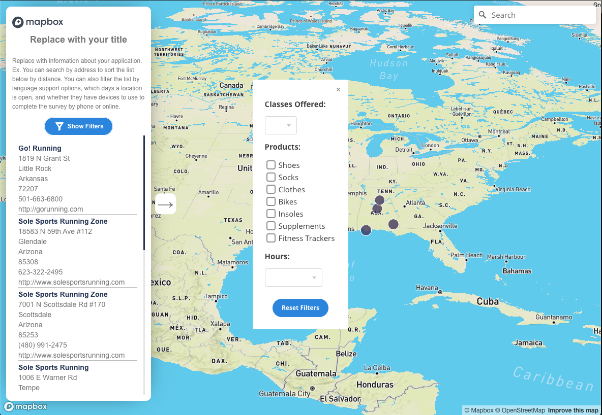

The Store Locator template is based on our [Store Locator tutorial](https://docs.mapbox.com/help/tutorials/building-a-store-locator/) with the addition of filter options and the ability to use a tileset or [Algolia](https://www.algolia.com/) as the backend for your store data.  Customize a few fields in the code to match it to your data fields and make it your own.




## Getting started

There are a few resources you'll need to get started: 

**Templates:**

* [Sample code](https://github.com/mapbox/StoreLocatorTemplate)
* [Sample data spreadsheet](https://github.com/mapbox/StoreLocatorTemplate/blob/main/docs/exampleData.csv)

**Tools we'll use:**

* Text Editor (Atom, VSCode, JSFiddle) to write and edit your code.‍
* [Mapbox account](https://www.mapbox.com/signup/) to access: ‍‍‍
<p className = "block">
<a href="https://www.mapbox.com/mapbox-studio/">Mapbox Studio</a> to create your map style.
</p>
<p>Mapbox GL JS to add interactivity to your map and publish it on the web‍‍.</p>


## Set up your CSV

Set up a CSV with the data for your map. 
The CSV will need the following: 

1. Longitude and latitude fields

2. Filterable fields (fields you want to use to filter your data)

Note: An example CSV file with sample data is available in the Docs folder. 

<br>

**Longitude and latitude fields:**

Each location needs latitude and longitude coordinates to appear as a marker on your map. Name, Address, and additional fields can be displayed on the sidebar and within popups. The field names are **Latitude** and **Longitude** and not Lat or Long or another abbreviation.

Need help with generating lat/long points?  You can use [csv2geocode](https://github.com/veltman/csvgeocode) can be used to geocode your records uisng the Mapbox Geocoder. 

    "csvgeocode input.csv output.csv --url "http://api.tiles.mapbox.com/v4/geocode/mapbox.places/{{Address Line 1}}.json?access_token=your mapbox token" --handler mapbox

**Filterable fields:**

Each filter that you want to create should have its own column in the spreadsheet. Within a column, each input option must be separated by a comma. The columns Languages, Devices_available, and Clients are all examples of filterable fields. Notice how in the sample spreadsheet, there is a column for Languages and each row within that column contains language options - with multiple options separated by a comma. 

**Filters and column headers are case sensitive**, so be sure that input values are uniform. For example, if we initialize the filter for ‘Monday’ then entries inputted as ‘monday’ or ‘Mon’ would not be affected. Additionally, entries missing a comma such as ‘Monday Tuesday’, would not be removed with the filters ‘Monday’ or ‘Tuesday’.

## Copy the template code 

Download the template from the [GitHub repository](https://github.com/mapbox/StoreLocatorTemplate). Unzip the folder. In the 'storeLocator-template' folder, you will see 3 folders:

Docs:
* config_template.js: This is the file you will be working in.

Tileset:
This is for the tileset based backend
* index.html: This contains the HTML and some CSS styling rules from [Assembly.css](https://labs.mapbox.com/assembly/) for the template. You can open this file in your browser to see your progress as you edit your code - or use a local server option like the ‘Go Live’ function in VSCode.
* js/app.js: This contains the code for the template. 
* css/style.css: This file has additional styling rules for the application. 

Algolia: This is the for the Algolia based backend
* index.html: This contains the HTML and some CSS styling rules from [Assembly.css](https://labs.mapbox.com/assembly/) for the template. You can open this file in your browser to see your progress as you edit your code - or use a local server option like the ‘Go Live’ function in VSCode.
* js/app.js: This contains the code for the template. 
* css/style.css: This file has additional styling rules for the application. 


## Configure the template

Set up your app by making some small edits to the config_tempalte.js file, using in your text editor. Save it as config.js and place it in the folder for your chosen backend.

### Choose a Mapbox style 

Mapbox Light is included in the template by default. To use a different base map from Mapbox [core styles](https://docs.mapbox.com/api/maps/#styles) or your own custom style, swap in the style URL of your choice.

```js
style: 'mapbox://styles/mapbox/light-v10',
```

### Add your Mapbox credentials

Without an access token, the rest of the code will not work.‍

[Login](http://account.mapbox.com/) or [create a free Mapbox account](https://www.mapbox.com/signup/). Find your access token on your [Access tokens page](https://www.mapbox.com/account/access-tokens/) or the main page you sign into your [Mapbox account](https://www.mapbox.com/account).

Note: We recommend using the URL restriction feature on the token to avoid token misuse and want to emphasize that only public tokens should be posted to public repositories. You can find out more information about how to securely manage your access tokens [here](https://docs.mapbox.com/help/troubleshooting/how-to-use-mapbox-securely/).

**Copy and paste your access token into the code, here:**

```js
 accessToken = 'Replace with your access token';
```


### Tileset backend

Upload your spreadsheet with the store location data to [Mapbox.com](https://studio.mapbox.com/tilesets/) as a new [tileset](https://docs.mapbox.com/studio-manual/reference/tilesets/). Add the tileset URL(example: "mapbox://username.5lsiq3po") and [source layer name](https://docs.mapbox.com/help/glossary/source-layer/) to the configuration file.

```
    tileset: "tileset URL",
    sourceLayerName: "Source Layer Name"
```

### Algolia Backend

Upload your spreadsheet with the store location to [Algloia](https://www.algolia.com/) as a new [index](https://www.algolia.com/doc/api-client/methods/indexing/). Add your Algolia App ID, Algolia Token and Algloia index name
```
    algoliaAppID: 'XXXXXXXXXXXX', //only needed if using algolia backend
    algoliaToken: 'XXXXXXXXXXXXXXXXXXX',  //only needed if using algolia backend
    algoliaIndex: 'StoreLocations', //only needed if using algolia backend

```

### Center the map

By default, the map is centered on Washington and is set to Zoom 6. Update where the map is centered by replacing the longitude and latitude coordinates with new coordinates and adjusting the zoom level.

Mapbox provides maps in [23 zoom levels](https://docs.mapbox.com/help/glossary/zoom-level/), with 0 being the lowest zoom level (fully zoomed out) and 22 being the highest (fully zoomed in).

```js
    center: [-86.8104, 33.5186], // [lng, lat],
    pitch: 60,
    zoom: 6, // zoom extent
```

### Add a title and description 

Consider how much space your text will take up on the screen. Note that because of the mobile-friendly design of this template, the description text will not be visible on small screens, if using the default template code.

```js
    title: 'Replace with your title',
    description: 'Replace with information about your application.',
```

### Change sidebar listing information 

Add information about each location to the sidebar. Replace the placeholders ‘Header’, ‘Info 1’, ‘Info 2’’ with your data column names. If you would like to add information from more columns to the sidebar, add each 'new field' in quotes and separate them with commas.

```js
    sideBar: ['Header', 'Info 1', 'Info 2'],
```

### Add popups

Whenever a user clicks on the sidebar or on an individual location displayed on your map, a popup corresponding to that field in your data will be displayed. To populate your popup with information, replace the default ‘Popup Information’ with the name of the column from your data that contains the information that you would like to display (e.g. ‘Location_Name’ or ‘Address’).

```js
    popupInfo: ['Popup Information'], 
```

### Add filters 

Time to add some custom filters! This application accepts two different types of filters: drop down or checkbox. You can add as many filters to the template as you want, but for ease of use we recommend limiting the number of filters to 2-3. By default, the application displays 3 filters.


<br>

### Drop down filters

To initialize a dropdown filter, first set the ‘type’ to ‘dropdown’. Next, add a title for your filter. In the example above, the titles for the drop downs are “Languages supported: " and "Clients: ".

Next, replace ‘Column Name ’ with the column header containing the filterable values. Lastly, add the filterable values to the list of options, being careful to put the values in quotes and separate them by commas. Each value should be in quotes and separated by a comma. For example, if we wanted to filter by days of the week the listItems entries would be : 

listItems: [‘Monday’, ‘Tuesday’, ‘Wednesday’, ‘Thursday’, ‘Friday’ ]

```js
type: 'dropdown',
title: 'Title of filter: ',
columnHeader: 'CSV Filter Column Name',
listItems: [
            'filter one',
            'filter two',
            'filter three',
            'filter four',
            'filter five',
            'filter six',
            'filter seven'
        ]
```

### Checkbox filters

To initialize a checkbox filter, first set the ‘type’ to ‘checkbox‘. Next, add a title for your filter. In the example above, the title is “Devices available: ". 

Next, replace ‘Column Name’ with the column header containing the filterable values. Lastly, add the filterable values to the list of options, being careful to put the values in quotes and separate them by commas. Each value should be in quotes and separated by a comma. For example, if we wanted the filters to match the example above, the listItems entries would be: 

listItems: [‘Phone’, ‘Wi-Fi’, ‘Adaptive Laptops’]

```js
type: 'checkbox',
title: 'Title of filter: ',
columnHeader: 'CSV Filter Column Name', 
listItems: ['Computer', 'Wi-Fi', 'Adaptive Laptops'] 
```

## View your map 

From the root folder for the preferred back end(tileset or algolia) run:
```parcel index.html```


## Finished project 

Use [Parcel](https://parceljs.org/) to package your application for deployment in your environment


*Want to share what you’ve built? Tweet it with #builtwithmapbox*
